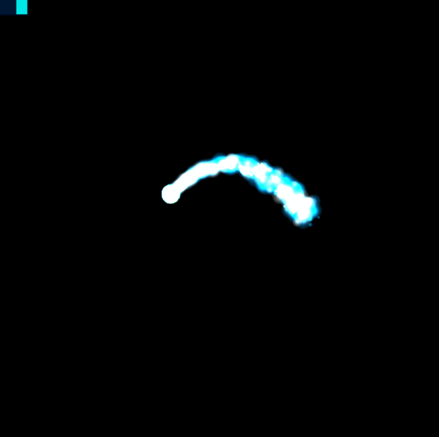
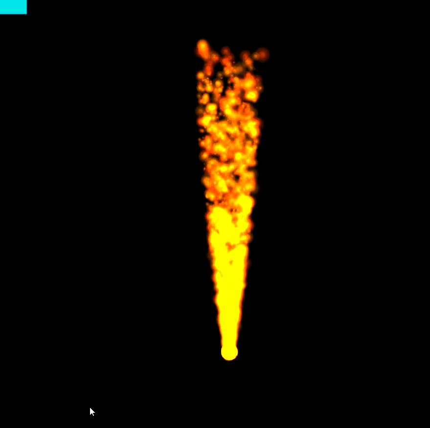

[TOC]
# 基于THREE.js 的各类特效库

命名非常随意，仅供参考

## 1. 粒子特效
### 1.1 water_gun
水枪特效，基于three.js的粒子系统，可用于水枪特效，烟花、雪、甚至火焰特效等。
参数列表：
```javascript
  export interface WaterGunParams {
        a: THREE.Vector3; // 加速度 默认【0，-9.8，0】
        v: THREE.Vector3[]; // 初速度 模越大越有劲 支持多组长度与p一致
        p: THREE.Vector3[]; // 初位置 支持多组长度与v一致
        ground: THREE.Plane; // 地面位置
        Epsilon: number; // 时间步长 越小越慢 越大越快，可以用于粘性的模拟
        countPerGroup: number; // 每组粒子数

        size: number; // 粒子大小
        color: THREE.Color[]; // 粒子颜色

        shake_position: number; // 抖动位置
        shake_speed: number; // 抖动速度 越大越散开（花洒） 越小越聚拢(水柱)
        shake_time: number; // 抖动时间
        shake_size: number; // 抖动大小

    }
```
正常版本
``` javascript
let flameParams: any = {
		v: [new THREE.Vector3(3, 3, 0)],		
        p: [new THREE.Vector3(0, 1, 0)],		
        ground: new THREE.Plane(new THREE.Vector3(0, 1, 0), 10),
		countPerGroup: 30,
		color: [
            new THREE.Color("#039BE5"),
            new THREE.Color("#039BE5"),            
            new THREE.Color("#F5F5F5"),
        ],
        Epsilon: 1 / 100,// 越小越慢
		shake_position: 0.01,
        shake_speed: 0.1, // 越大越散开
        shake_time: 1,
        shake_size: 1
	}
```

初始速度与a平行
``` javascript
let flameParams: any = {
		v: [new THREE.Vector3(0, 3, 0)],		
        p: [new THREE.Vector3(0, 1, 0)],		
        ground: new THREE.Plane(new THREE.Vector3(0, 1, 0), 10),
		countPerGroup: 30,
		color: [
            new THREE.Color("#039BE5"),
            new THREE.Color("#039BE5"),            
            new THREE.Color("#F5F5F5"),
        ],
        Epsilon: 1 / 100,// 越小越慢
		shake_position: 0.01,
        shake_speed: 1, // 越大越散开
        shake_time: 1,
        shake_size: 1
	}
```


改个颜色，甚至能当火焰用
``` javascript
let flameParams: any = {
		v: [new THREE.Vector3(0, 3, 0)],
        a: new THREE.Vector3(0, 1, 0),		
        p: [new THREE.Vector3(0, 1, 0)],		
        ground: new THREE.Plane(new THREE.Vector3(0, 1, 0), 10),
		countPerGroup: 30,
		color: [
            new THREE.Color("#FF3D00"),			
            new THREE.Color("#EF6C00"),
        ],
        Epsilon: 1 / 100,// 越小越慢
		shake_position: 0.01,
        shake_speed: 1, // 越大越散开
        shake_time: 1,
        shake_size: 1
	}
```

支持多个粒子组，加大粘性后当雪花用
``` javascript
let flameParams: any = {		
		v: [
			new THREE.Vector3(0, -3, 0),
			new THREE.Vector3(0, -3, 0),
			new THREE.Vector3(0, -3, 0),
			new THREE.Vector3(0, -3, 0),
		],
		p: [
			new THREE.Vector3(0, 0, 0),
			new THREE.Vector3(1, 0, 1),
			new THREE.Vector3(1, 0, 0),
			new THREE.Vector3(0, 0, 1)
		],
        ground: new THREE.Plane(new THREE.Vector3(0, 1, 0), 10),
		countPerGroup: 30,
		color: [
            new THREE.Color("#039BE5"),
            new THREE.Color("#039BE5"),            
            new THREE.Color("#F5F5F5"),			
        ],
        Epsilon: 1 / 200,// 越小越慢
		shake_position: 0.01,
        shake_speed: 2, // 越大越散开
        shake_time: 1,
        shake_size: 1
	}
```


